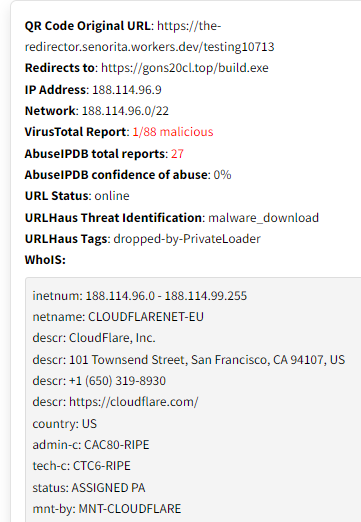

The final product of this blog can be found [here](https://henard.tech/QRcode-decode.html)!  
  

Cybersecurity is and will always be a game of cat and mouse.  
  
One of the latest tactics used by threat actors is an attack vector called "Quishing". 
"Quishing" is the act of creating QR codes that contain malicious data such as fake login pages. 
This attack vector is particularly effective due to its simplicity.  
  
Hoxhunt reports that 22% of phishing attacks used QR codes in October[^HoxHunt].  
  
I realized we're kinda in the wild west with this new threat. Not many shields or swords to fight this dragon. So, I rolled up my sleeves and thought, "Why not build something myself?"

## QR Codes: The Double-Edged Sword of Digital Convenience and Security Risks

QR codes, or "Quick Response Codes", are now a staple in our digital life. 
They encode data into a 2-D image that smartphones can easily read, storing information like URLs and Wi-Fi credentials.
    
We saw a massive surge in the use of QR codes in 2020 due to... You guessed it, COVID!
The contactless aspect of QR codes allowed many companies to replace items commonly touched with QR codes, such as Food Menus.  

However, this convenience also presents security risks.  
  
Consider this scenario: You are at a hotel with poor cell service, but you urgently need to send documents. 
A QR code in the elevator allows you to connect to the hotel Wi-Fi, but instead actually connects you to an [Evil Twin](https://usa.kaspersky.com/resource-center/preemptive-safety/evil-twin-attacks) network set up by an attacker. 
Now, your sensitive data is exposed without your knowledge.  

## Decoding the Mystery: QR Code to URL Conversion

I knew the first step in creating this platform would be decoding the QR code.  
  
I came across an API created by [goqr.me](https://goqr.me/api/doc/) that would allow me to do exactly that. 
After some testing, I was successfully able to send a QR code and receive back the URL. 
    
After testing with samples of legitimate Quishing files, I realized that attackers had a trick up their sleeve to bypass initial reputation scans of the URL...  

## Unraveling the Web: Tracking URL Redirects

Attackers were using legitimate redirect services to hide the destination URL contained in the payload.  
  
Many times the redirect service would return a clean report when scanned even though the destination address was malicious. 
Some Quishing samples redirected up to 6 times before reaching the destination address! 
  
I found an API developed by [Redirect-Checker.net](https://api.redirect-checker.net) that would follow the redirects and return the destination address as well as the destination IP!  
This proved to be very useful when performing analysis in later steps.

## Peering into the Digital Abyss: Shodan Insights
One analysis tool that I have come to love is Shodan. 
Shodan is a search engine that will gather information about most internet-connected devices and systems. 
  
Using [Shodan's API](https://developer.shodan.io/api) along with the destination IP I received earlier, I was able to gather the following: 
- Autonomous System Number [(ASN)](https://csrc.nist.gov/glossary/term/autonomous_system_number)
- Open ports on the destination IP address
- Country that the IP was located in
- Operating System running on the destination IP

## Guardians of the Net: AbuseIPDB Analysis
Another common reputation database that I like to check against is AbuseIPDB. 
AbuseIPDB also conveniently [offers an API](https://www.abuseipdb.com/api.html).  
    
Leveraging AbuseIPDB API, I am able to gather the following:
- Abuse Confidence Score
- ISP that owns the IP address
- Usage type of the IP address
- Number of times that IP has been reported
- If the IP has ever been used as a Tor relay  

## A Shield Against Digital Threats: VirusTotal's Role
Arguably one of the most common online analysis tools is VirusTotal.
VirusTotal is an online service that analyzes suspicious files and URLs. 
  
By this point you can probably guess... they have an [API](https://docs.virustotal.com/reference/overview)!  
  
I utilized this API to gather: 
- The [CIDR block](https://aws.amazon.com/what-is/cidr/#:~:text=A%20CIDR%20block%20is%20a,regional%20internet%20registries%20(RIR).) the IP address belonged to
- An analysis of the IP address
- A WhoIs containing the domain registrar information  

## The URL Sentinel: URLHaus API Integration
The last tool that I leveraged when analyzing these QR codes was URLHaus.  
Prior to this project I was not very familiar with URLHaus. 
After seeing how large of a database URLHaus offered, I knew this would be very useful for analysis. 
[URLHaus API](https://urlhaus-api.abuse.ch/#urlinfo) provides data that is not available from other services I am using.  
Here is what I am gathering from URLHaus: 
- The status of the URL (Offline or Online)
- The payload that the address is delivering
- A link to the URLHaus analysis of the queried URL
- Tags associated with the queried URL

## User Experience: Aggregating the data
After all the queries have been made, I needed a way to cleanly present this back to the user.  
I never have been proficient in front-end design so my design process went something like this:  
__Step 1:__ Format how the API response is displayed to the user  
__Step 2:__ Ask peers and friends what they thought of the design  
__Step 3:__ GOTO Step 1  

After many iterations of redesigning the front-end experience, I finally settled on a design.  
Here is the output of Quishing sample scan:  

## Conclusion
Gaining the ability to create my own API has introduced a completely new method to approaching projects in the future. 
The customization that comes with having complete control over the data returned is invaluable.  
  
Now, users can scan QR codes on my platform with confidence, knowing they'll be alerted to any potential security risks.

This project was a significant step in my journey as a developer and a valuable contribution to cybersecurity awareness. It's a testament to how innovative solutions can emerge from challenges, especially in the ever-evolving landscape of digital security.  

## Recreate this yourself!
The source code of my API is available on [Github](https://github.com/zdhenard42/QR-Analysis-API). 
I would recommend utilizing [Cloudflare Workers](https://developers.cloudflare.com/workers/) when first creating an API due to the generous usage limits that come with the [free plan](https://developers.cloudflare.com/workers/platform/pricing/#workers).  
  
Feel free to create a pull request with any improvements you see fit! 

[^HoxHunt]: [HoxHunt Stats](https://www.hoxhunt.com/blog/insights-hoxhunt-cybersecurity-human-risk-benchmark-challenge#:~:text=22%25%20of%20phishing%20attacks%20used%20QR%20codes%20in%20October,-While%20a%20decent&text=We've%20compiled%20a%20significant,first%20weeks%20of%20October%202023.)