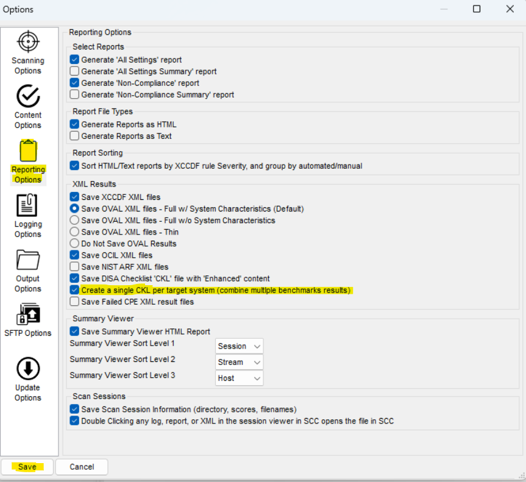
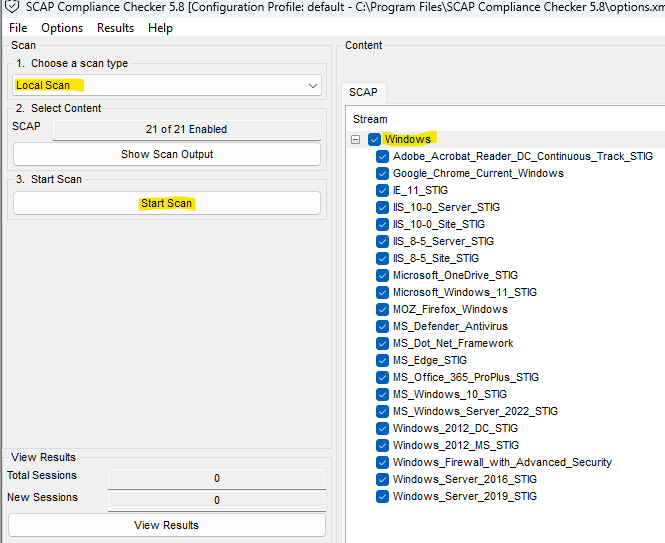
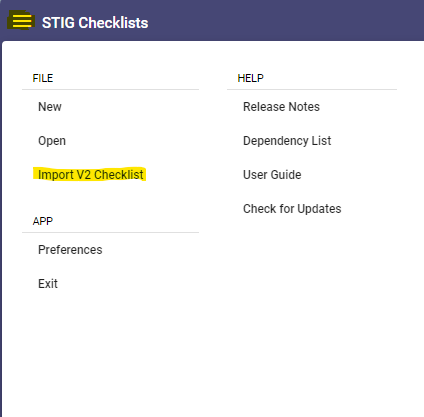
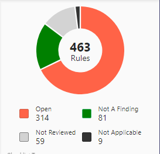
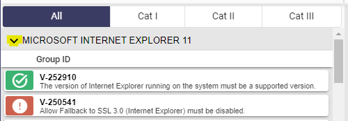
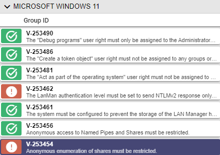
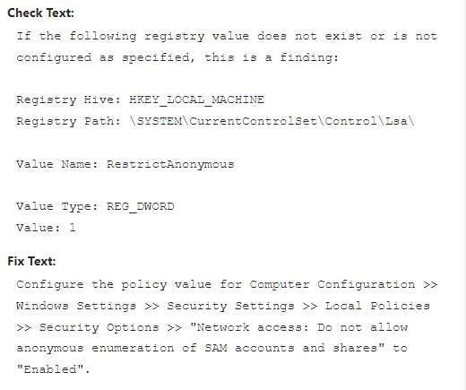
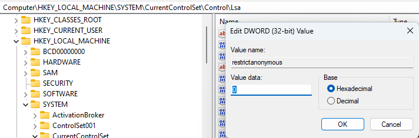

# Introduction
In this guide, I'll show you how to patch Windows 11 to meet Department of Defense security standards, a skill highly valued in the corporate world. 

Ideal for both cybersecurity beginners and experts, mastering this process will not only secure systems but also significantly enhance your resume. 

Let's begin this journey to transform your Windows 11 into a secure system! 🚀
  
  
# Initial Setup: Tools of the Trade
Let's start by downloading the essentials. Don't worry, this is very straightforward.
#### Installing STIG Viewer
1. Navigate to [STIG Viewer's page](https://public.cyber.mil/stigs/srg-stig-tools/).  
2. Download and run "STIG Viewer X.X-Win64 msi"  

#### Installing SCAP
1. Visit the [SCAP Tools page](https://public.cyber.mil/stigs/scap/). 
   - Scroll down to "__SCAP Tools__", select page 3, and grab "SCC X.X Windows".

2. Open the downloaded folder and launch "Windows_Setup". Just keep hitting next until it is installed.

3. With SCAP open, navigate to options, then "Show Options" -> "Reporting Options". Check "Create a single CKL per target system" and save.
   

# Scan Time: Brew Coffee and Wait
Fire up SCAP, ensure "Windows" is checked, set to "Local Scan", and hit "Start Scan". 
Dismiss any warnings; they're just being dramatic.  
This will take about 5 minutes...perfect time for a quick coffee break!☕
   

# The Reveal: Analyzing Results
The scan's done! Time to play detective with the results.🕵️

1. Hit 'view results', then 'Checklist'. Right-click on "DISA checklist" and choose "Show in Directory".
2. Note the .CKL file path – it's important.
3. Open STIG Viewer and click the "Checklists" image.
4. Click the three lines on the top left then "Import V2 Checklist".
5. Find your SCAP-generated CKL file and select it.
   
  
Ta-da! We can now see a detailed report of our system.
     
   
   *Tip: Collapse sections with the black arrow for a clearer view.*

# Decoding the Scan: What are we looking at?
With our scan results now in hand, let's decipher what's in front of us. 
This tool finds misconfigurations in our system that could be potentially vulnerable.  
  
Pay extra attention to "Cat 1" findings signify the highest severity. 
We will primarily focus on these first as they are "Critical Vulnerabilities". 

# Remediation: Keeping The Bad Guys Out
If we select "CAT I" at the top, we'll unveil all Category 1 vulnerabilities. Those marked with a red exclamation point are the ones currently open on our system.  
When you click on these, you'll typically find three sections: Discussion, Check Text, and Fix Text. 
Our main focus here is the Fix Text – This tells us how to close those security gaps.

# Patching Up: A Hands-On Example

 **WARNING!**
   Be careful with the fixes, especially in a live environment. Always seek permission before proceeding, and remember, not all open findings need to be closed – doing so might hamper functionality.

Let's get to work on an actual vulnerability:  
"Anonymous enumeration of shares must be restricted." 
   
This Category 1 finding was a red flag in my system. The following image shows what this looks like.

  
The "Check Text" tells us the exact registry key that caused this to be a finding.  

```
HKEY_LOCAL_MACHINE\SYSTEM\CurrentControlSet\Control\Lsa\
```
So let's go to our registry key and check it out!  

We see that "restrictanonymous" is set to zero, so let's switch that to a 1.  
Just like that, we've neutralized our first vulnerability!

# Rescanning: Verifying the Fixes
Once we've patched up our vulnerabilities, it's vital to ensure that our fixes have applied and have not introduce new issues. Here's how:

1. Re-open SCAP and set up as before.  
2. Run a new "Local Scan."  
3. Compare the new results with the previous ones – the goal is to see those patched vulnerabilities disappear.  
   
This re-scan serves as our quality check, confirming that our defenses are stronger and our efforts were successful.

# Extra Credit: Delve into the 'Why'
Don't stop at just patching up vulnerabilities.  
Take the extra step to research and understand why each issue is a vulnerability in the first place. 
  
This deeper knowledge will not only make you more proficient in cybersecurity but will also provide you with critical insights needed to anticipate and counter future threats. 

# Further Exploration: Investigating Unreviewed Vulnerabilities
Additionally, turn your attention to the vulnerabilities marked as 'Not Reviewed'.  
These potential vulnerabilities were not automatically assessed and require you to manually verify that they are not a finding.  
  
Manually investigating these will provide you with a more comprehensive understanding of your system’s security landscape.


# Conclusion: Your Cybersecurity Journey Continues
You've now learned how to elevate the security of Windows 11 to meet Department of Defense standards, a valuable skill in today’s cybersecurity landscape.  
  
Remember, this journey doesn't just end with fixing vulnerabilities; keep exploring how to stay secure!