In this post I dive into the simplicity and security of Cloudflare tunneling, which is offered by Cloudflare at no cost. This post will guide you on how to easily and safely expose internal services without exposing your network.

## Initial Setup
To expose your internal services over a Cloudflare tunnel, you will first need to create a Cloudflare account. You can [register here](https://dash.cloudflare.com/sign-up).  
  
You will then need to own a domain and setup [Cloudflare nameservers](https://developers.cloudflare.com/dns/zone-setups/full-setup/setup/) for DNS on the domain. 
If you do not already own a domain, I recommend purchasing through [Cloudflare](https://www.cloudflare.com/products/registrar/) due to their very affordable "At-Cost" model. 

## Building your first tunnel
After you have successfully tied your domain to your Cloudflare account, we can start creating tunnels!  
In your Cloudflare dashboard, navigate to 'Zero Trust' -> 'Access' -> 'Tunnels'
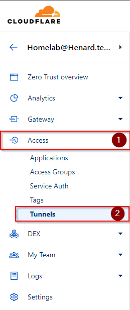
  
Once you are at the 'Tunnels' screen, simply click "Create a tunnel". 
The first prompt you will see is the tunnel name. 
This can be any label you want to use that helps you to identify the network that is being tunneled.
Keep in mind that 99% of the time all of your exposed services will be routed through the same tunnel.  
The next step is running the connector for your tunnel. 
I highly recommend docker for this due to the ease of management. 
As long as the service is reachable from the docker container, then it can be routed through a tunnel. 
  
Upon selecting docker as your environment, you will be given a command to run in the terminal on your host device.
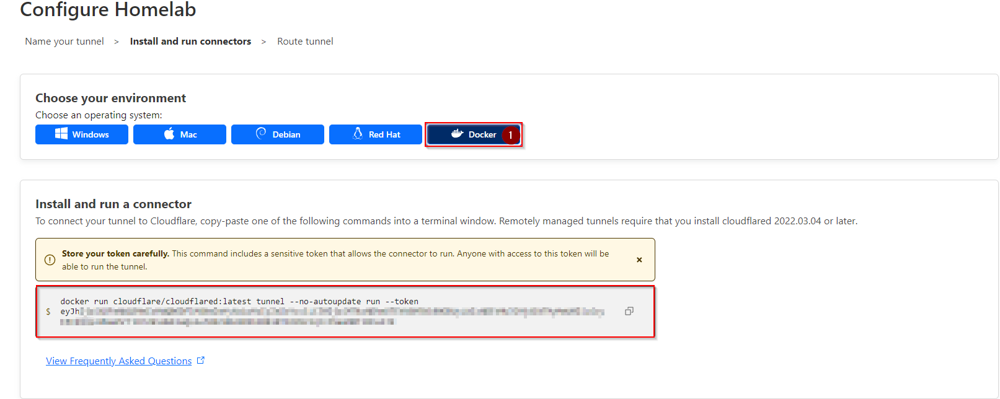

Simply enter this command into your host CLI and your tunnel will be built!  
I like to add '-d' to the command so that the connector is started in detached mode and will run in the background.
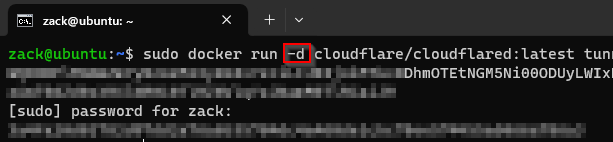

## Exposing Internal Services

The tunnel is built, now we just have to start routing services through it. 
  
For this demo, I will route an instance of self-hosted CyberChef which is running on "10.0.24.7:3000" on my homelab. 
All we have to do is enter the subdomain we want it to be accessible at, and where is it located on my internal network.
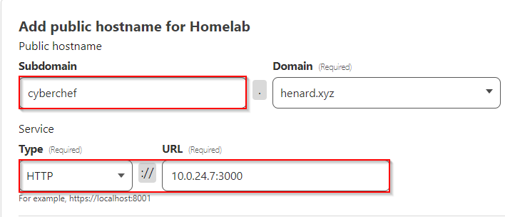

## Accessing The Service

We are done! Really, that is all there is to it. 
We can now navigate to Cyberchef.henard.xyz and access our internal instance of Cyberchef!
The best part is that Cloudflare will take care of the SSL Cert for us!
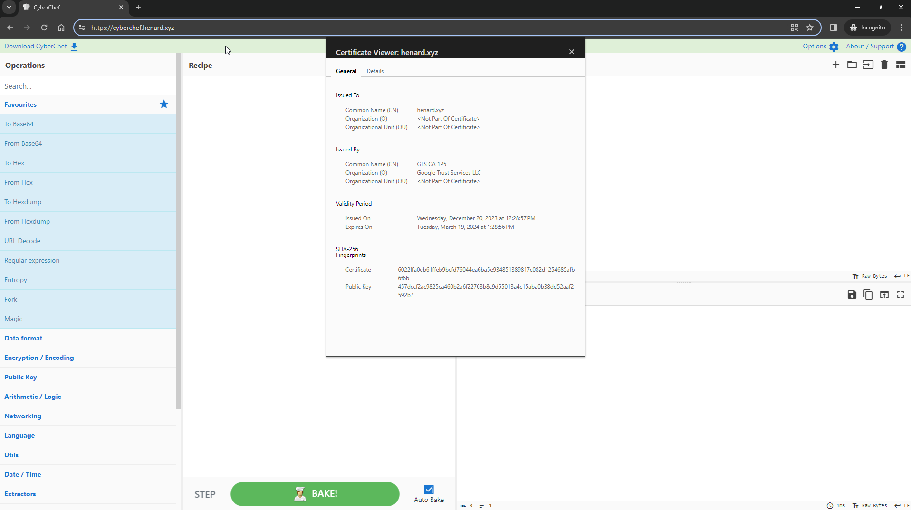

## Adding Additional Services

Now that we have a tunnel, it is super easy to add additional services. 
Just go back to your Cloudflare tunnel configuration and add another 'Public Hostname'. 
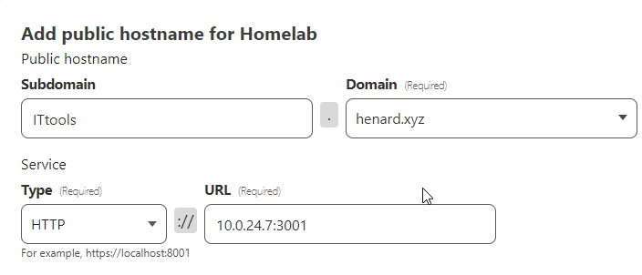
  
Now if we go to ITtools.Henard.xyz we can access our self-hosted instance of ITtools!
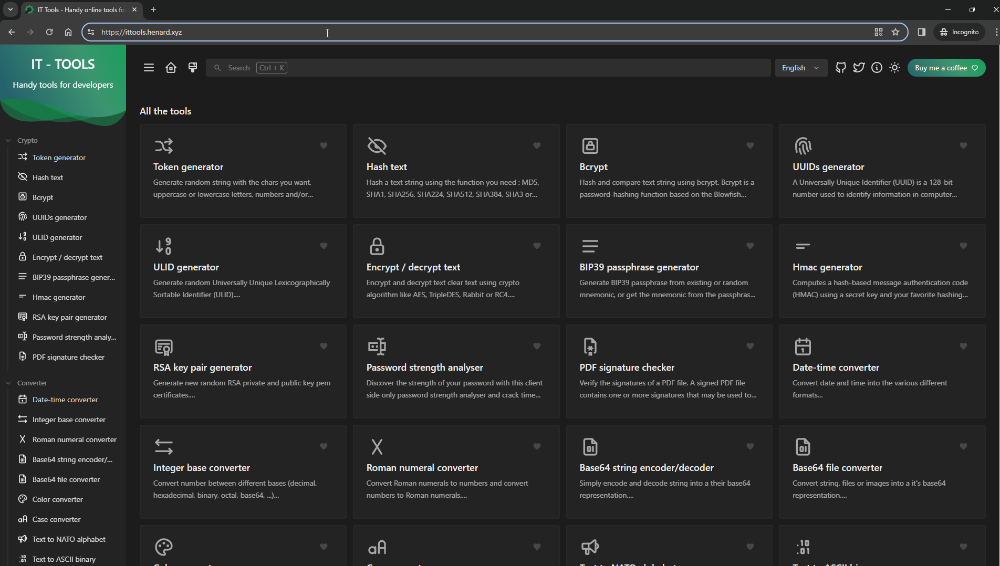

## Bonus: Adding Authentication and Access Rules
Cloudflare makes it super easy to add an authentication portal in front of your tunnels.  
  
In your Cloudflare dashboard, go to 'Zero Trust' -> 'Settings' -> 'Authentication' -> 'Login Methods'. 
We can now see all of the authentication methods that Cloudflare supports.. which is a lot.  
  
Just click your preferred authentication method and follow the steps to add it. 
I will use One-Time Pin since it requires no initial configuration to implement.
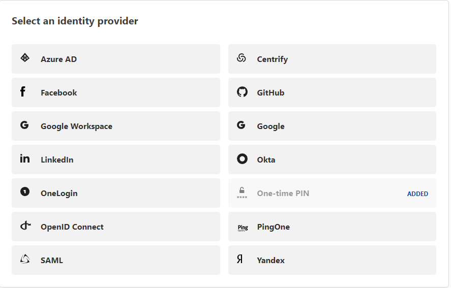
  
After you have added our authentication method, go to 'Access' -> 'Applications'. 
Click on "Add an Application" and our application type will be "Self-Hosted". 
Enter the application domain that we are using to host our services, which in my case is "cyberchef.henard.xyz".  
Towards the bottom of the page you will see a section called "Identity Providers"; This is where we will choose what authentication methods we want in front of our tunnel. 
I only have one enabled, so that is what will be used.
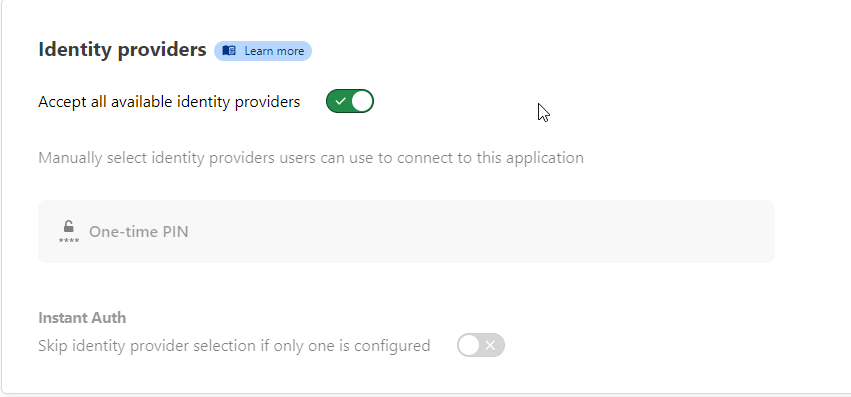

After we click next, we are asked to add policies. 
This is where we can implement many different kinds of rules as to who can or cannot access our service. 
We can even block entire countries!
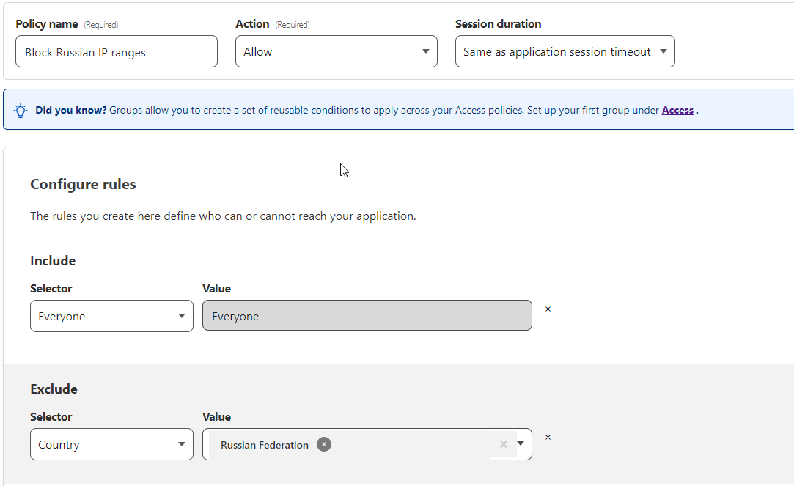

Once we have all the policies are created we just click 'next' -> 'Add Application'.
Now if we try to access cyberchef.henard.xyz, we are redirected to an authentication page that will prompt us for a one-time pin.
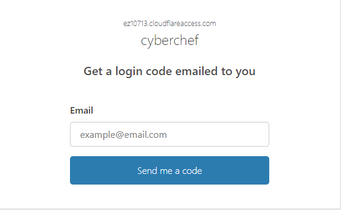